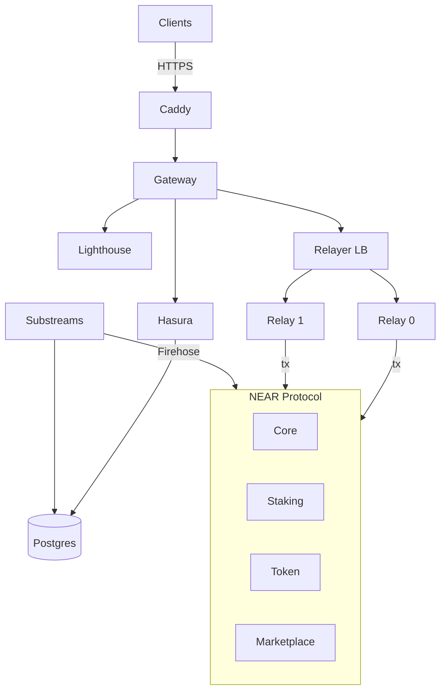

[](https://github.com/OnSocial-Labs/onsocial-protocol/actions/workflows/core-onsocial-ci.yml)
[](https://github.com/OnSocial-Labs/onsocial-protocol/actions/workflows/staking-onsocial-ci.yml)
[](https://github.com/OnSocial-Labs/onsocial-protocol/actions/workflows/token-onsocial-ci.yml)

[](https://github.com/OnSocial-Labs/onsocial-protocol/actions/workflows/onsocial-gateway-ci.yml)
[](https://github.com/OnSocial-Labs/onsocial-protocol/actions/workflows/relayer-ci.yml)
[](https://github.com/OnSocial-Labs/onsocial-protocol/actions/workflows/substreams-ci.yml)

[](https://github.com/OnSocial-Labs/onsocial-protocol/actions/workflows/deploy-testnet.yml)
[](https://github.com/OnSocial-Labs/onsocial-protocol/actions/workflows/verify-core-onsocial-testnet.yml)
[](https://github.com/OnSocial-Labs/onsocial-protocol/actions/workflows/verify-staking-onsocial-testnet.yml)
[](https://github.com/OnSocial-Labs/onsocial-protocol/actions/workflows/verify-token-onsocial-mainnet.yml)

[](LICENSE.md)
[](https://near.org)

# OnSocial

A user-owned protocol for the next era of decentralized interactions.

---

## Quickstart

```bash
git clone https://github.com/OnSocial-Labs/onsocial-protocol.git
cd onsocial-protocol
make setup && make build && make test
```

> **Production?** See the [Deployment Guide](Resources/deployment-guide.md).

---

## Architecture



---

## Monorepo Layout

| Directory | Description | Docs |
|---|---|---|
| **Smart Contracts** | | |
| [contracts/core-onsocial](contracts/core-onsocial) | Posts, groups, stores, permissions | [README](contracts/core-onsocial/README.md) |
| [contracts/staking-onsocial](contracts/staking-onsocial) | Stake SOCIAL → earn rewards | [README](contracts/staking-onsocial/README.md) |
| [contracts/token-onsocial](contracts/token-onsocial) | SOCIAL token (NEP-141) | [README](contracts/token-onsocial/README.md) |
| [contracts/marketplace-onsocial](contracts/marketplace-onsocial) | Listings & commerce | [README](contracts/marketplace-onsocial/README.md) |
| **Backend Services** | | |
| [packages/onsocial-gateway](packages/onsocial-gateway) | API gateway (GraphQL, storage, relay) | [README](packages/onsocial-gateway/README.md) |
| [packages/onsocial-relayer](packages/onsocial-relayer) | Tx relayer (Rust, KMS-backed signing) | [README](packages/onsocial-relayer/README.md) |
| [packages/onsocial-rpc](packages/onsocial-rpc) | NEAR RPC client | — |
| [packages/onsocial-portal](packages/onsocial-portal) | Portal UI | [README](packages/onsocial-portal/README.md) |
| **Indexing** | | |
| [indexers/substreams](indexers/substreams) | Real-time blockchain indexing (3 sinks) | [README](indexers/substreams/README.md) |
| **Infrastructure** | | |
| [deployment/](deployment) | Docker Compose, Caddy, systemd | — |

---

## Links

[Contributing](CONTRIBUTING.md) · [Deployment Guide](Resources/deployment-guide.md) · [Make Targets](Resources/MAKE_TARGETS.md) · [Resources](Resources/README.md)

---

MIT — [LICENSE.md](LICENSE.md)
