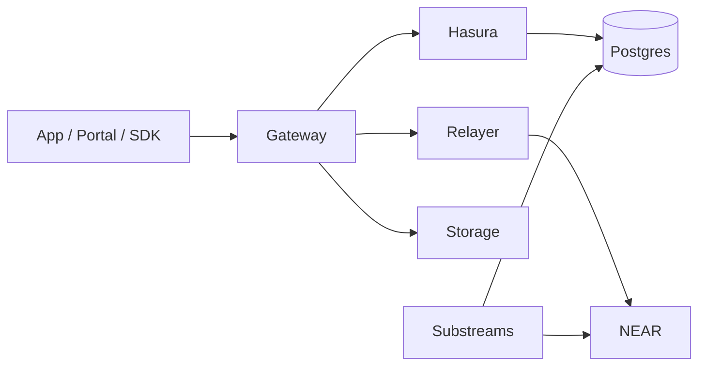

# OnSocial Protocol

**Social, the way it should be. What will you build?**

OnSocial is an open social graph and SOCIAL economy on [NEAR](https://near.org) — profiles, posts, groups, scarces, boosts, and spend actions — with a gateway SDK for apps.

[](LICENSE.md)
[](https://near.org)
[](https://github.com/OnSocial-Labs/onsocial-protocol/actions/workflows/deploy-testnet.yml)

**Live:** [onsocial.id](https://onsocial.id) · [App](https://app.onsocial.id) · [Portal](https://portal.onsocial.id) · [API](https://api.onsocial.id)  
**Testnet:** [testnet.onsocial.id](https://testnet.onsocial.id) · [testnet app](https://testnet.app.onsocial.id) · [core](https://testnet.nearblocks.io/address/core.onsocial.testnet) · [token](https://testnet.nearblocks.io/address/token.onsocial.testnet) · [boost](https://testnet.nearblocks.io/address/boost.onsocial.testnet) · [social-spend](https://testnet.nearblocks.io/address/social-spend.onsocial.testnet) · [scarces](https://testnet.nearblocks.io/address/marketplace.onsocial.testnet)

---

## Quick start

```bash
pnpm install
make setup                 # Docker images for contracts / Node
pnpm --filter @onsocial/portal dev   # http://localhost:3000
pnpm --filter @onsocial/app dev      # http://localhost:3060
```

Build against the SDK and gateway first; contract and indexer details live in their package READMEs. Full make targets: [Resources/MAKE_TARGETS.md](Resources/MAKE_TARGETS.md).

---

## Architecture


```mermaid
flowchart LR
  Clients[App / Portal / SDK] --> GW[Gateway]
  GW --> Hasura[Hasura]
  GW --> Relayer[Relayer]
  GW --> Storage[Storage]
  Hasura --> PG[(Postgres)]
  Substreams[Substreams] --> PG
  Relayer --> NEAR[NEAR]
  Substreams --> NEAR
```

Clients talk HTTP to the **gateway**. Indexed reads come from **Hasura/Postgres** (fed by **substreams**). Writes go on-chain via wallets or the **relayer**. Contracts on NEAR hold the graph, token, boost, social-spend, and scarces logic.

---

## Repo map

| Path | Role |
|---|---|
| **Contracts** | |
| [contracts/core-onsocial](contracts/core-onsocial) | Posts, groups, profiles, permissions |
| [contracts/token-onsocial](contracts/token-onsocial) | SOCIAL (NEP-141) |
| [contracts/staking-onsocial](contracts/staking-onsocial) | Stake SOCIAL → rewards |
| [contracts/boost-onsocial](contracts/boost-onsocial) | Lock SOCIAL, boost-seconds rewards |
| [contracts/social-spend-onsocial](contracts/social-spend-onsocial) | Support, amplify, seasons, endorsements |
| [contracts/scarces-onsocial](contracts/scarces-onsocial) | Listings & commerce |
| [contracts/intents-onsocial](contracts/intents-onsocial) | Outcome bounties / escrow |
| [contracts/vesting-onsocial](contracts/vesting-onsocial) | Token vesting vaults |
| **Packages** | |
| [packages/onsocial-sdk](packages/onsocial-sdk) | Gateway-first TypeScript SDK |
| [packages/onsocial-gateway](packages/onsocial-gateway) | GraphQL, storage, relay API |
| [packages/onsocial-relayer](packages/onsocial-relayer) | Tx relayer (Rust, KMS signing) |
| [packages/onsocial-rpc](packages/onsocial-rpc) | NEAR RPC client (failover / retry) |
| [packages/onsocial-app](packages/onsocial-app) | Consumer app |
| [packages/onsocial-portal](packages/onsocial-portal) | Portal UI (governance, partners, seasons) |
| [packages/onsocial-pages](packages/onsocial-pages) | `*.onsocial.id` subdomain router |
| [packages/onsocial-backend](packages/onsocial-backend) | Rewards bot & crediting |
| [packages/onsocial-ui](packages/onsocial-ui) | Shared UI primitives |
| [packages/onsocial-text-card](packages/onsocial-text-card) | SVG text-card generator |
| [packages/onsocial-intents](packages/onsocial-intents) | NEAR Intents / pricing client |
| [packages/onsocial-rewards](packages/onsocial-rewards) | Rewards credit SDK |
| **Indexing & infra** | |
| [indexers/substreams](indexers/substreams) | Real-time chain indexing |
| [deployment/](deployment) | Docker Compose, Caddy, systemd |

---

## Links

[Contributing](CONTRIBUTING.md) · [Deployment](Resources/deployment-guide.md) · [Make targets](Resources/MAKE_TARGETS.md) · [Resources](Resources/README.md)

MIT — [LICENSE.md](LICENSE.md)
